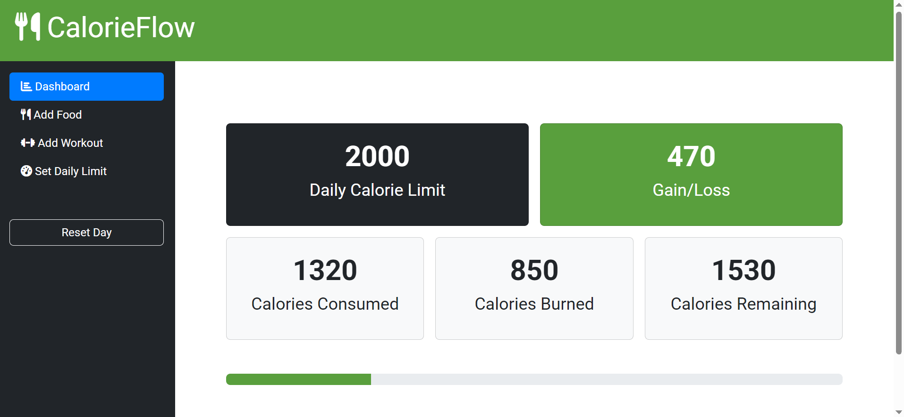
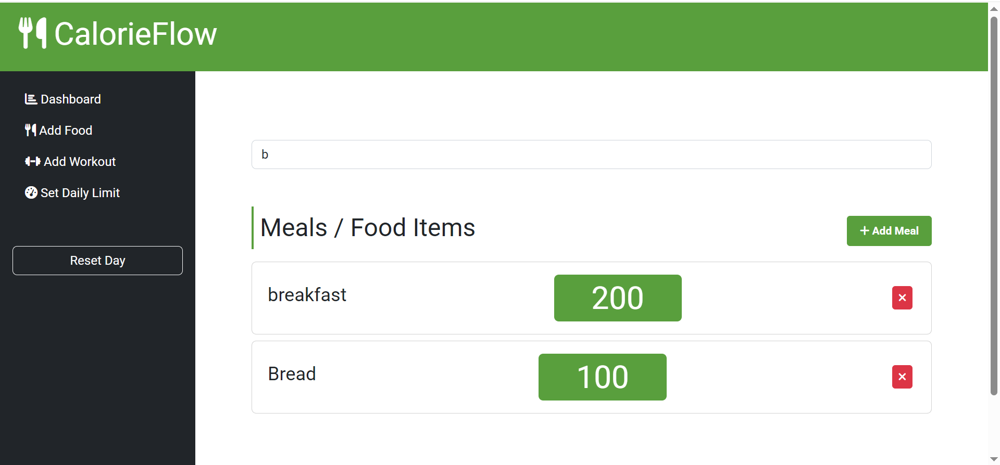
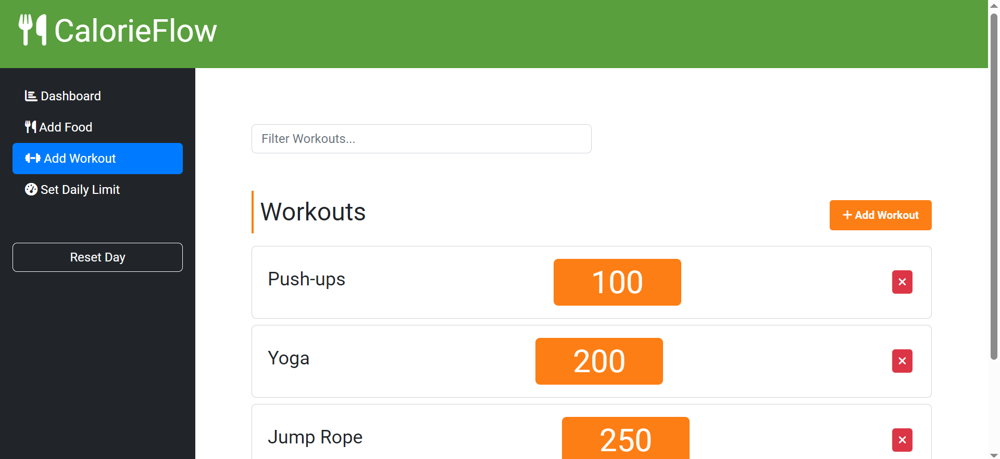
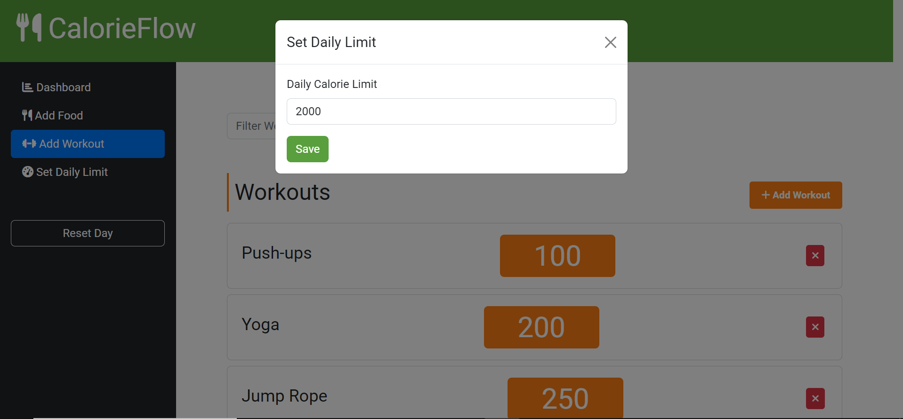

# CalorieFlow 🍏💪

## 👨‍💻 Author: Muhammad Zeeshan

## 🚀 Live Preview:

Check out the live demo:👉 [CalorieFlow](https://mzeeshan138.github.io/calorie-flow-app/)

## 📌 About CalorieFlow

**CalorieFlow** is a simple yet powerful **calorie and workout tracker** designed to help you monitor your daily nutrition and fitness goals. With an intuitive interface and real-time insights, staying on top of your health has never been easier!

## 🎯 Key Features

✅ **Calorie & Meal Tracking** – Log meals and track daily calorie intake.\
✅ **Workout Logging** – Record workouts and track exercise progress.\
✅ **Dashboard Insights** – Get real-time insights into your fitness journey.\
✅ **Fully Responsive** – Works seamlessly across all devices.

## 🛠️ Technologies Used

🚀 **Built with modern web technologies:**

-   **HTML5** – Semantic structure for better readability & SEO.
-   **CSS3** – Modern, responsive design with smooth UI.
-   **JavaScript** – Dynamic and interactive functionality.
-   **Progressive Web App (PWA)** – Accessible anywhere, even offline!

## 📂 Project Structure

```
CalorieFlow/
│── index.html        # Main HTML file
│── css/              # Stylesheet & Bootstrap classes
│── js/               # JavaScript logic
│── images/           # Images & icons
└── README.md         # Project documentation
```

## 📌 Topics Covered

🔹 Progressive Web App\
🔹 Self-Improvement\
🔹 Fitness Tracking\
🔹 Meal Tracking\
🔹 Nutrition & Diet Planning\
🔹 Responsive Web Design

## 📸 Screenshots

Here are some glimpses of **CalorieFlow** in action:

### 📊 Dashboard



### 🍏 Add Food


### 🔍 Filter Food



### 💪 Add Workout



### 🎯 Set Daily Limits



## 📬 Contact Me

📧 **Email:** [muhammadzeeshan588685@gmail.com](mailto:muhammadzeeshan588685@gmail.com)\
🔗 **LinkedIn:** [Muhammad Zeeshan](https://www.linkedin.com/in/muhammad-zeeshan-087584306/)\
🐙 **GitHub:** [mzeeshan138](https://github.com/mzeeshan138)

---

⭐ **If you find this project helpful, please consider giving it a star!** ⭐
